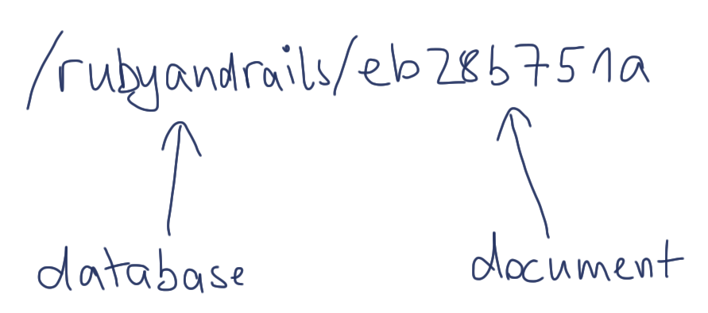

!SLIDE

# CouchDB is a web server #

!SLIDE bullets incremental

## A conversation with CouchDB ##

* and curl

!SLIDE commandline incremental 

# Everything is HTTP #

    $ curl -v localhost:5984/rubyandrails

    HTTP/1.1 404 Object Not Found

    {"error":"not_found","reason":"no_db_file"}

!SLIDE commandline incremental

# Everything is HTTP #

    $ curl -v -X PUT localhost:5984/rubyandrails

    HTTP/1.1 201 Created

    {"ok":true}

!SLIDE commandline incremental

# Everything is HTTP #

    $ curl -v localhost:5984/rubyandrails

    HTTP/1.1 200 OK

    {"db_name":"rubyandrails","doc_count":0,"doc_del_count":0,
    "update_seq":0,"purge_seq":0,"compact_running":false,
    "disk_size":79,"instance_start_time":"1286130434654709",
    "disk_format_version":5}

!SLIDE smaller

# Everything is a Resource #

!SLIDE center

!SLIDE commandline small incremental

# Creating Documents #

    $ curl -X PUT /rubyandrails/eb28b751a -d @-
    {"_id": "eb28b751a",
    "name": "Why Riak Search Matters...",
    "published_at": "2010/10/08 17:00:00 +0000",
    "tags": ["riak", "full text search"]}

    HTTP/1.1 201 Created
    Location: http://localhost:5984/rubyandrails/eb28b751a
    Etag: "1-6f773089b853fd5f7867562b179a854a"

    {"ok":true,"id":"eb28b751a",
    "rev":"1-6f773089b853fd5f7867562b179a854a"}
    
!SLIDE center

# Attachments #

!SLIDE smaller commandline incremental

# Creating Attachments #

    $ curl -d @logo.png -X PUT /rubyandrails/eb28b751a/logo.png?rev=1-de1e01
    {"ok":true,"id":"eb28b751a","rev":"5-b32285dc188a7a5e2a05ee62c6fcfeff"}

!SLIDE small javascript

    {
      '_id': 'eb28b751a'
      "_attachments": {
        'logo.png': {
          "content_type": "image/png",
          "revpos": 5,
          "length": 36145,
          "stub": true
        }
      }
    }
!SLIDE small

## Attachments are Resources too ##

!SLIDE commandline incremental

    $ curl localhost:5984/rubyandrails/eb28b751a/logo.png
    ZOMG BINARY DATA!
