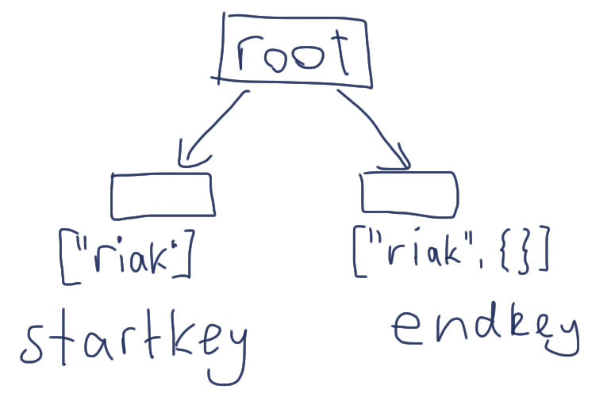

!SLIDE

# CouchDB is a database #

!SLIDE center

# B-Tree #

!SLIDE

# Querying for Data #

!SLIDE

# Map/Reduce #

!SLIDE

# Map transforms data #

!SLIDE

# Reduce aggregates data #

!SLIDE bullets incremental

# In CouchDB #

* Map generates lookup keys
* Keys point to a document
* Keys can have additional values

!SLIDE javascript

# Find by Title #

    @@@ javascript
    function(doc) {
      emit(doc.title, null);
    }

!SLIDE javascript

# Find only Posts by Title #

    @@@ javascript
    function(doc) {
      if (doc.type == "Post") {
        emit(doc.title, null);
      }
    }
!SLIDE javascript

# Find by Tags #

    @@@ javascript
    function(doc) {
      for(var idx in doc.tags) {
        emit(doc.tags[idx], 1)
      }
    }

!SLIDE javascript

# Reduce #

    @@@ javascript
    function(keys, values, rereduce) {
      return sum(values);
    }

!SLIDE javascript

# Reduce Reduced #

    @@@javascript
    _sum

!SLIDE javascript small

# Design Documents #

    {
      "_id": "_design/posts"
      "views": {
        "by_tag": {
          "map": "function(doc) {..}",
          "reduce": "function(keys, values, rereduce) {..}"
        }
      }
    }

!SLIDE small

# Getting that data #

    /rubyenrails/_design/posts/_view/by_tag?key="riak"

    {"rows":[
    {"key":null,"value":2}
    ]}

!SLIDE bullets incremental

## Only returns reduce results ##

* 2 Documents with tag `riak`
* Assumes `reduce=true`

!SLIDE bullets incremental

## The Key ##

* Must be a valid JSON value
* `"riak"` not `riak`

!SLIDE smaller

# Include documents #

    .../_view/by_tag?key="riak"&include_docs=true&reduce=false

    {"total_rows":4,"offset":2,"rows":[
      {"id":"eb28b751a","key":"riak","value":1,"doc":
          {"title":"Why Riak Search Matters...",...}}}},
      {"id":"eb28b751b","key":"riak","value":1,"doc":
          {"title":"Why I'm Excited...",...}}
    ]}

!SLIDE small

## Group by Tag ##

    .../_view/by_tag?key="riak"&group=true

    {"rows":[
      {"key":"riak","value":2}
    ]}

!SLIDE small

## Group by Tags ##

    .../_view/by_tag?group=true

    {"rows":[
      {"key":"couchdb","value":1}
      {"key":"full text search","value":1}
      {"key":"riak","value":2}
    ]}
!SLIDE

# Slightly more complex #

!SLIDE 

## Find by Tag ##
## ordered by publication date ##

    @@@ javascript
    function(doc) {
      for(var idx in doc.tags) {
        emit([doc.tags[idx], doc.published_at], 1);
      }
    }

!SLIDE

## Resulting Keys ##

    @@@ javascript
    ["riak",    "2010/10/20 18:25:16 +0100"]
    ["riak",    "2010/10/12 18:25:16 +0100"]
    ["couchdb", "2010/09/01 18:25:16 +0100"]

!SLIDE smaller

## Only the first document ##

    .../_view/by_tag?reduce=false&include_docs=true&limit=1 

    {"total_rows":4,"offset":0,"rows":[
    {"id":"eb28b751a","key":
      ["couchdb","2010/11/12 18:25:16 +0100"],"value":1}
    ]}
    
!SLIDE

## Only posts tagged with `riak` ##

!SLIDE smaller

    .../_view/by_tag?startkey=["riak"]&endkey=["riak", {}]

    {"rows":[
      {"key":["riak","2010/10/18 17:00:00 +0000"],"value":1},
      {"key":["riak","2010/10/20 18:25:16 +0100"],"value":1}
    ]}

!SLIDE

## Now in descending order ##

!SLIDE smaller

    .../_view/by_tag?startkey=["riak",]&endkey=["riak", {}]
      &descending=true

    {"rows":[
      {"key":["riak","2010/10/20 18:25:16 +0100"],"value":1},
      {"key":["riak","2010/10/12 18:25:16 +0100"],"value":1}
    ]}

!SLIDE

# Wait, what? #

!SLIDE

# View collation #

!SLIDE center

!SLIDE center

!SLIDE bullets incremental

# View collation #

* Mind bending
* Important when fetching ranges
* And ordering documents

!SLIDE center

# All Glory to the B-Tree! #

