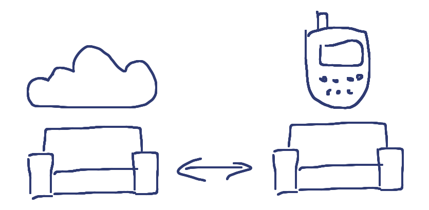

!SLIDE

# Cool Things #

!SLIDE bullets incremental

# Changes Feed #

* Real time JSON feed of document updates

!SLIDE smaller commandline incremental

    $ curl localhost:5984/rubyandrails/_changes?feed=continuous

    {"seq":10,"id":"eb28b7510","changes":[{"rev":"2-eec205a"}],"deleted":true}
    {"seq":18,"id":"_design/post","changes":[{"rev":"8-69920ee"}]}
    {"seq":25,"id":"1234567","changes":[{"rev":"9-0d883ef"}]}
    {"seq":28,"id":"eb28b751a","changes":[{"rev":"6-15c29f5"}]}
    {"seq":30,"id":"eb28b751a","changes":[{"rev":"1-a8f0890"}]}
    {"seq":31,"id":"eb28b751a","changes":[{"rev":"5-4404521"}]}

!SLIDE bullets incremental

* Can be filtered using JavaScript
* Use to e.g. expire caches

!SLIDE bullets incremental

# Replication #

* Replicate any database
* With any database
* At any time

!SLIDE center

# Replication #

!SLIDE center

# Offline by Default #

!SLIDE

# CouchDB Gotchas #

!SLIDE bullets incremental

# All reads go to disk #

* No memory cache
* Fast disks
* HTTP cache

!SLIDE bullets incremental

# Views are updated on read #

!SLIDE bullets incremental

# One Document at a time #

* No joins
* Only loose links

!SLIDE bullets incremental

# Transactionless #

* Consistency for a single document
* Writes are ACID

!SLIDE bullets incremental

# Append-Only #

* Never updates
* Always appends
* Requires compaction

!SLIDE

## Should CouchDB be my next database? ##

!SLIDE

## Not necessarily. ##

!SLIDE

## Play with it. ##

!SLIDE

# Questions? #
